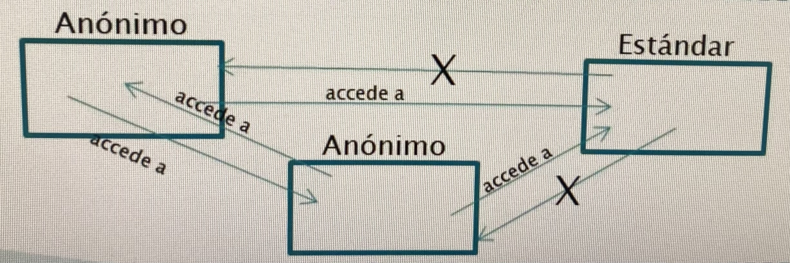

# 4. Módulos anónimos y automáticos

# 4.1. Módulos anónimos

- Conjunto de paquetes de clases de una aplicación que no forman parte de un módulo. Habitualmente, se distribuyen en un _.jar_
- Desde estas clases, se puede acceder a cualquier paquete de clases que se encuentre en el _classpath_, incluyendo tantos otros módulos anónimos como estándares
- Solo pueden acceder a las clases de un módulo anónimo las clases de otros módulos anónimos

 

# 4.2. Módulos automáticos

- Cuando un módulo anónimo se incluye en el _module-path_ de una aplicación modular, se convierte en un módulo automático
- Desde estos, se puede acceder a cualquier paquete de clases, tanto de módulos anónimos/automáticos como de estándares
- Exportan implícitamente todas sus clases, que podrán ser utilizadas por otros módulos que lo requieran

 

# 4.3. Ejemplo

