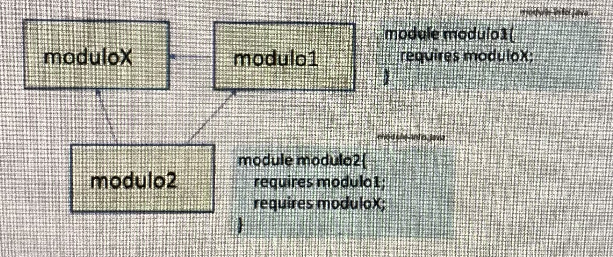
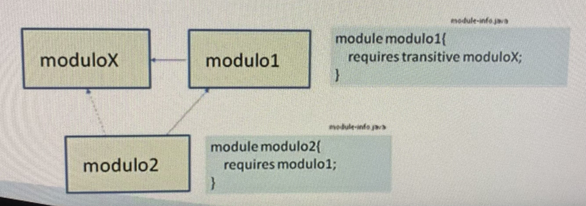

# 5. Otras características de la modularidad

# 5.1. Exportación específica

- Se puede indicar que un determinado paquete de un módulo sea accesible únicamente por cierto módulo
- Se emplea la palabra reservada _to_

  ```
  module module1 {
       exports com.package1 to moduleX, moduleK;
  }

  // el paquete com.package1 sólo es accesible para moduleX y moduleK
  ```

<br>

# 5.2. Dependencias transitivas

- Envita redundancias a la hora de requerir dos módulos en los que, a su vez, uno require al otro

  

- Con dependencia transitiva

  

<br>

# 5.3. Servicios

- **Servicio**: interfaz definida en un módulo
  ```
  module service {
       exports com.Interface1;
  }
  ```
- **Proveedor de servicio**: módulo que implementa la interfaz

  ```
  module proveedor {
     provides com.Interface1 with com.Class1;
  }
  ```

  **Consumidor**: módulo que utiliza el servicio

  ```
  module consumidor  {
     uses com.Interface1;
  }
  ```

<br>

# 5.4. Acceso por reflexión

- Es posible especificar que los paquetes especificados del módulo son accesibles vía reflexión a otros módulos
  ```
  module moduleX {
       opens com.package;
  }
  ```
- Incluso, que lo sean solo a ciertos módulos
  ```
  module moduleX {
       opens com.package to moduleA, moduleB;
  }
  ```
